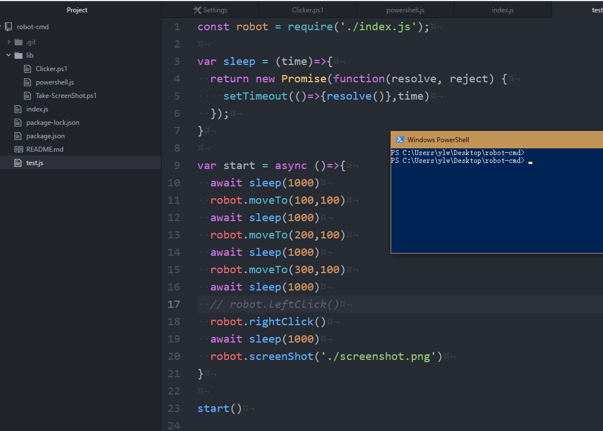

# robot-cmd
Automatically operate the keyboard and mouse, do not need gyp

## Example

```javascript
const robot = require('robot-cmd')

robot.moveTo(100,100)
robot.leftClick()
robot.doubleClick()
robot.rightClick()
robot.screenShot('./screenshot.png')
robot.sendKeys('S D F G H {ENTER}')
```
## sendKeys() KeyCode Definition at https://technet.microsoft.com/en-us/library/ff731008.aspx?f=255&MSPPError=-2147217396


